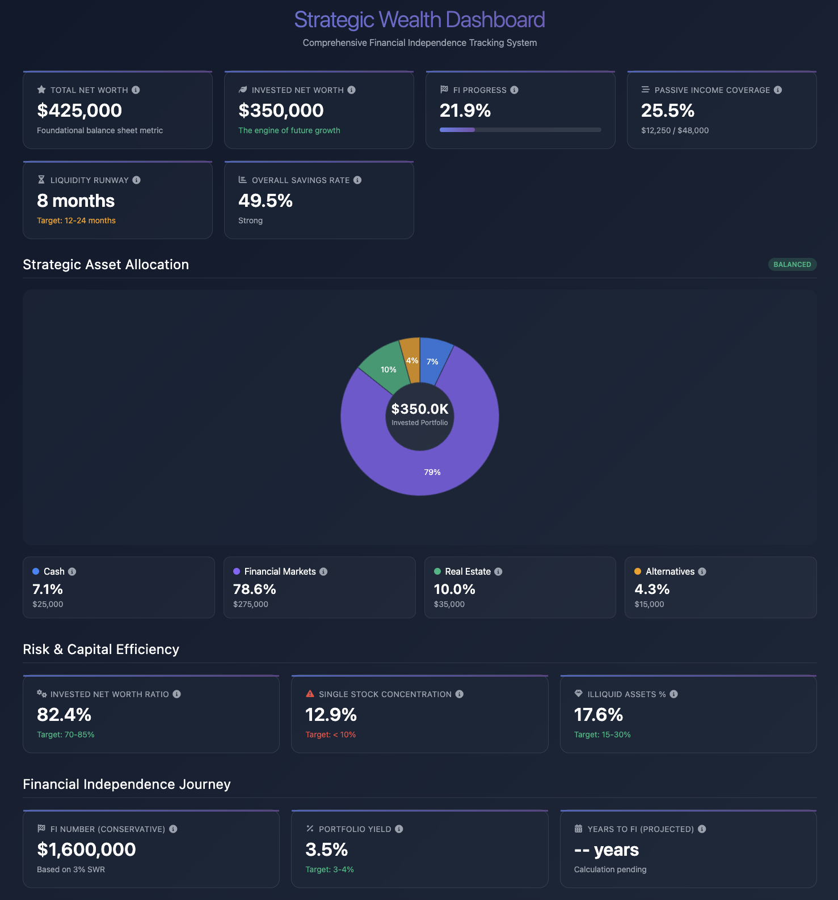

# Wealth Dashboard for Google Sheets

A sophisticated financial tracking dashboard that integrates seamlessly with Google Sheets to provide real-time visualization of your wealth metrics, asset allocation, and progress toward financial independence.

**Author:** Michael Bettan



## Why This Dashboard?

### The Problem with Existing Tools

Popular wealth management platforms like **Monarch Money**, **Empower (formerly Personal Capital)**, **Tiller Money**, **You Need A Budget (YNAB)**, and **Pocketsmith** excel at account aggregation and transaction tracking, but they fall short in one critical area: **customizable executive-level KPIs and strategic wealth visualization**.

### Pain Points We Solve

1. **Missing Executive Metrics**: Traditional tools focus on budgeting and spending, not sophisticated metrics like FI progress, capital efficiency ratios, or concentration risk
2. **Lack of Customization**: Pre-built dashboards don't adapt to your specific financial strategy or goals
3. **Poor Strategic Visualization**: No unified view of asset allocation, liquidity runway, and financial independence metrics
4. **Platform Lock-in**: Your data is trapped in proprietary systems with limited export options
5. **No Lightweight Solution**: Heavy applications when you just need a quick executive summary

### Our Solution

This dashboard provides:
- **Instant Executive View**: See all critical wealth metrics at a glance
- **Platform Agnostic**: Export your account balances from any tool (Monarch Money, Empower, Tiller Money, YNAB, Pocketsmith, etc.) into a spreadsheet
- **Fully Customizable**: Adjust metrics, benchmarks, and calculations to match your strategy
- **Mobile Accessible**: Check your wealth metrics from any device
- **Zero Ongoing Costs**: No subscriptions, just a one-time setup

## Overview

This dashboard transforms your exported financial data into an interactive, visually appealing dashboard with strategic KPIs that matter for wealth building and financial independence.

## Features

- **Real-time Data Sync**: Automatically pulls data from your Google Sheets
- **Executive KPI Dashboard**: Track metrics that actually matter for wealth building
- **Interactive Asset Allocation**: Visual sunburst chart showing true portfolio distribution
- **Risk Analysis**: Monitor concentration risk, liquidity, and capital efficiency
- **Financial Independence Tracking**: Calculate and track your FI number with conservative SWR
- **Mobile-First Design**: Access from phone, tablet, or desktop
- **Professional UI**: Modern, dark-themed interface optimized for quick scanning
- **Works with Any Platform**: Import data from Monarch Money, Empower (formerly Personal Capital), Tiller Money, YNAB, Pocketsmith, or manual entry

## How It Works

1. **Export your data** from your existing wealth management tool (Monarch Money, etc.)
2. **Paste into Google Sheets** using our simple format
3. **View your dashboard** with executive-level KPIs instantly
4. **Access anywhere** - desktop, tablet, or mobile phone

## Installation Instructions

### Step 1: Prepare Your Google Sheet

1. Create a new Google Sheet or open an existing one
2. Create a sheet named **"0. Dashboard"** (exact name required)
3. Set up your data in the following format:

| Column A (Metric) | Column B ($ Value) |
|-------------------|-------------------|
| Total net worth with Primary Residence | $425,000 |
| Invested Net Worth | $350,000 |
| Liquid Net Worth | $275,000 |
| | |
| Cash | $25,000 |
| Financial Markets | $275,000 |
| Real Estate | $35,000 |
| Alternatives | $15,000 |
| | |
| Concentrated Google Position | $45,000 |
| Retirement | $125,000 |
| Invested Taxable accounts | $150,000 |
| Taxable Account / Stocks | $100,000 |
| Taxable Account / Bonds | $50,000 |
| | |
| Emergency funds (Idle cash) | $15,000 |
| Real Estate Syndication | $20,000 |
| Primary Residence | $75,000 |
| Liquidity / Runway (months) | 8 |
| Illiquid Assets | $75,000 |

**Optional rows for full functionality:**
- Annual Passive Income (e.g., $12,250)
- Annual Expenses (e.g., $48,000)
- Annual Gross Income (e.g., $95,000)
- Age (e.g., 35)

### Step 2: Install the Apps Script

1. In your Google Sheet, click **Extensions** → **Apps Script**
2. Delete any existing code in the editor
3. Create two files:
   - `Code.gs` (this should already exist)
   - `Index.html` (click the **+** button → **HTML**)

4. Copy the entire contents of `Code.gs` from this repository into the Apps Script `Code.gs` file
5. Copy the entire contents of `Index.html` from this repository into the Apps Script `Index.html` file

### Step 3: Save and Deploy

1. Click the **Save** button (disk icon) in the Apps Script editor
2. Name your project (e.g., "Wealth Dashboard")
3. Close the Apps Script editor and return to your spreadsheet

### Step 4: Launch the Dashboard

After installation, you have three ways to access the dashboard:

#### Option 1: Sidebar (Recommended)
1. Refresh your Google Sheet
2. You'll see a new menu item: **🚀 Dashboard**
3. Click **🚀 Dashboard** → **Show Dashboard**
4. The dashboard will open in a sidebar on the right

#### Option 2: Modal Dialog
1. In the Apps Script editor, select the `showModal` function
2. Click **Run**
3. The dashboard will open as a modal dialog

#### Option 3: Web App (Advanced)
1. In Apps Script, click **Deploy** → **New Deployment**
2. Choose **Web app** as the type
3. Set execute as **Me** and access to **Anyone** (or as needed)
4. Deploy and copy the web app URL
5. Access the dashboard via the provided URL

## Data Format Requirements

### Currency Values
- Enter values with or without dollar signs
- Commas are optional
- Examples: `$1,234,567` or `1234567`

### Percentage/Numeric Values
- Enter as plain numbers
- Example: For liquidity runway, enter `12` for 12 months

## Customization

### Modifying Metrics
The dashboard looks for specific metric names in Column A. To customize:

1. Open `Index.html` in the Apps Script editor
2. Find the `DATA_CONFIG` object (around line 290)
3. Modify the metric names to match your spreadsheet

Example:
```javascript
const DATA_CONFIG = {
    totalNetWorth: 'Total net worth with Primary Residence',
    investedNetWorth: 'Invested Net Worth',
    // Add or modify as needed
};
```

### Adjusting Benchmarks
You can customize target ranges and thresholds:

1. Find the `BENCHMARKS` object in `Index.html`
2. Adjust values to match your financial goals

Example:
```javascript
const BENCHMARKS = {
    liquidityRunway: { low: 12, high: 24 }, // Months
    savingsRate: { strong: 30, excellent: 50 }, // Percentage
    // Modify as needed
};
```

## Troubleshooting

### Dashboard Not Loading
- Ensure the sheet is named exactly **"0. Dashboard"**
- Check that Column A contains the metric names
- Verify Column B contains the corresponding values
- Try refreshing the spreadsheet

### Permission Issues
- On first run, you'll need to authorize the script
- Click **Review Permissions** and follow the prompts
- Choose your Google account and allow access

### Data Not Updating
- Make sure you're editing the correct sheet
- Values should be in Column B
- Save your spreadsheet changes before opening the dashboard

## Features Explained

### Key Metrics
- **Total Net Worth**: Complete household balance sheet
- **Invested Net Worth**: Capital actively generating returns
- **FI Progress**: Progress toward financial independence
- **Passive Income Coverage**: How much of expenses are covered
- **Liquidity Runway**: Months of expenses covered by liquid assets
- **Savings Rate**: Percentage of income being saved

### Asset Allocation
Visual breakdown of your invested portfolio across:
- Cash reserves
- Financial markets (stocks, bonds, ETFs)
- Real estate investments
- Alternative investments

### Risk Metrics
- **Invested NW Ratio**: Capital efficiency metric
- **Single Stock Concentration**: Risk from individual positions
- **Illiquid Assets %**: Balance sheet flexibility

### FI Journey
- **FI Number**: Target for financial independence (3% SWR)
- **Portfolio Yield**: Annual income from investments
- **Years to FI**: Projected timeline (when data available)

## Mobile Access

### Adding to iPhone Home Screen

1. Open Safari on your iPhone
2. Navigate to your Google Sheet
3. Open the dashboard (🚀 Dashboard → Show Dashboard)
4. Tap the Share button (square with arrow)
5. Scroll down and tap "Add to Home Screen"
6. Name it "Wealth Dashboard"
7. Tap "Add"

Now you have one-tap access to your wealth metrics!

### Adding to Android Home Screen

1. Open Chrome on your Android device
2. Navigate to your Google Sheet
3. Open the dashboard
4. Tap the three-dot menu
5. Select "Add to Home screen"
6. Name it "Wealth Dashboard"
7. Tap "Add"

### Web App Deployment (Advanced Mobile Access)

For the best mobile experience, deploy as a web app:

1. In Apps Script, click **Deploy** → **New Deployment**
2. Choose **Web app** as the type
3. Set execute as **Me** and access to **Only myself**
4. Deploy and copy the URL
5. Open this URL on your phone
6. Add to home screen using steps above

This creates a full-screen app experience without browser chrome.

## Integration with Wealth Management Tools

### Exporting from Monarch Money
1. Navigate to your Accounts page
2. Export account balances as CSV
3. Copy the values into your Google Sheet

### Exporting from Empower (formerly Personal Capital)
1. Access your portfolio summary
2. Export or copy account values
3. Paste into the Google Sheet format

### Exporting from Tiller Money
1. Navigate to your accounts dashboard
2. Export account balances
3. Copy the values into your Google Sheet

### Exporting from YNAB (You Need A Budget)
1. Access your accounts page
2. Export account data
3. Paste into the Google Sheet format

### Exporting from Pocketsmith
1. Navigate to your accounts overview
2. Export account balances as CSV
3. Copy the values into your Google Sheet

### Manual Updates
Simply update the values in Column B of your spreadsheet whenever you want fresh data. Many users update monthly or quarterly for strategic planning.

## Use Cases

### Executive Review
- Quick morning check of key wealth metrics
- Board or advisor meeting preparation
- Strategic planning sessions

### Financial Planning
- Track progress toward FI number
- Monitor asset allocation drift
- Assess liquidity and risk metrics

### Family Wealth Management
- Share read-only dashboard with spouse
- Track family financial goals
- Educational tool for financial literacy

## Security & Privacy

- All data stays within your Google account
- No external servers or databases involved
- Script only accesses the current spreadsheet
- Uses Google's built-in security infrastructure
- No data is sent to third parties
- You maintain complete control of your financial information

## Support

For issues or questions about this dashboard, please ensure:
1. Your spreadsheet format matches the requirements
2. All required metrics are present
3. The Apps Script files are properly installed

## License

This project is provided as-is for personal financial tracking use.

## Acknowledgments

Built with Google Apps Script, LLM, HTML5, CSS3, and JavaScript. Uses Font Awesome for icons.

---

*Track your wealth, visualize your progress, achieve financial independence.*
